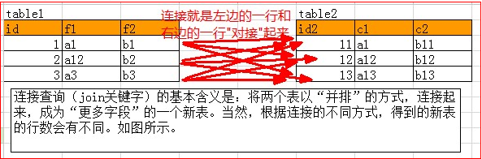
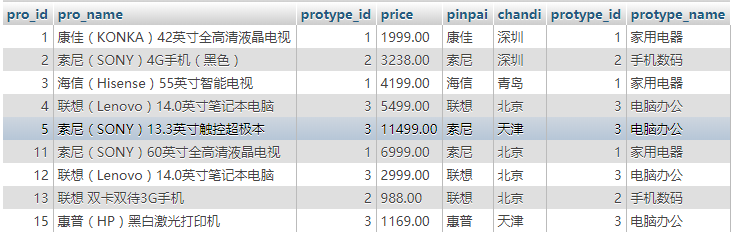
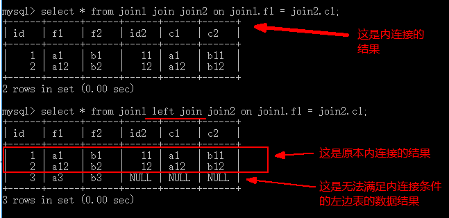
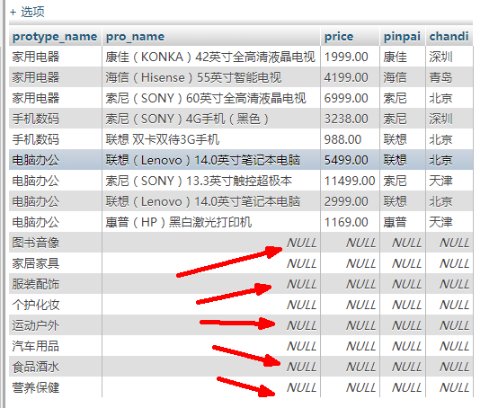
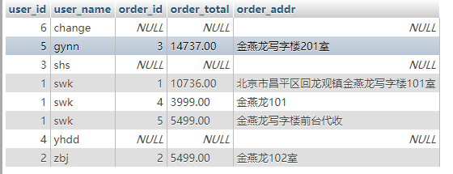

# 04_查询

## 1.联合查询

概念：联合查询是指将2个或是2个以上的字段数量相同的查询结果，“纵向堆叠”后合并为一个结果

示例：

准备数据join1

```
id  f1  f2
1	ff1	ff2
2	ff3	ff4
3	ff5	ff6
44	fff1	fff2

id2  d1  d2
11	ff1	ff2
22	ff3	ff4
33	ff5	ff6
44	dd1	dd2
```

```sql
select id,f1,f2 from join1 union select id2,d1,d2 from join2
```

查询结果如下：

```
id	f1	f2
1	ff1	ff2
2	ff3	ff4
3	ff5	ff6
44	fff1	fff2
11	ff1	ff2
22	ff3	ff4
33	ff5	ff6
44	dd1	dd2
```

**联合查询语法形式**

```sql
select 查询1
union [all 或 distinct]
select 查询2
union [all 或 distinct]
...
[order by 字段 [asc 或 desc]]
[limit 其实行号,数量]
```

说明：

1. **所有单个查询结果应该具有相等的列数**

2. 所有单个查询的列类型应该具有一致性，（**即每个查询的第N列的数据类型一致**）

3. 单个查询的列名可以不同，但最终的列名是第一个查询的列名（可以使用别名）

4. union可以带all或distinct参数，如果省略就是distinct，即默认已经消除重复行

5. 最后的order by或 limit是对整个联合之后的结果数据进行排序或重新限定

6. order by子句中的排序字段应该使用第一个查询中的字段名，如果有别名就必须使用别名

7. 可见，假设：

   查询1有n1行，m列

   查询2有n2行，m列

   则连个表“联合”之后的结果，有最多n1+n2行，m列。

示例1：

```sql
select id ,f2 from join1 union select id2,d2 from join2
查询结果：
id	f2
1	ff2
2	ff4
3	ff6
44	fff2
11	ff2
22	ff4
33	ff6
44	dd2
```

示例2：

```
select id,f2 from join1
union
select id2,d2 from join2 
order by id desc 
limit 0,4;

查询结果：
id	f2
44	fff2
44	dd2
33	ff6
22	ff4
```

## 2. 连接查询

连接（join）查询是将两个查询结果以**“横向对接”**的方式合并起来的结果

对比：联合查询是将两个查询结果以**“纵向堆叠”**的方式合并起来的结果

**概念：**连接查询，是将两个查询（或表）的每一行，以“两两横向对接“的方式，得到所有行的结果

即一个表中的某行，跟另一个表中的某行，进行“横向对接”，而得到一个新行

如下所示：



可见，假设：

- 表1有n1行，m1列
- 表2有n2行，m2列
- 则表1和表2“连接“之后就会有：n1*n2行，m1+m2列

### 2.1 连接查询语法

连接查询的基本语法：

```sql
select ...from 表1 [连接方式] join 表2 [on连接条件] where ...
```

示例：

```sql
select * from join1 join join2 

查询结果：
id	f1	f2	id2	d1	d2
1	ff1	ff2	11	ff1	ff2
1	ff1	ff2	22	ff3	ff4
1	ff1	ff2	33	ff5	ff6
1	ff1	ff2	44	fff1	fff2
```

可见，连接查询只是作为from子句的“数据源“。

或者说，连接查询是扩大了数据源，从原来的一个表作为数据源，扩大为多个表为数据源

连接查询包括以下不同形式：

交叉连接，内连接，外连接（分左外连接，右外连接）。

### 2.2 交叉连接

语法形式：

```sql
from 表1 [cross] join 表2
```

说明：

1. 交叉连接其实可以认为是连接查询的“完全版本”，即所有行都无条件的都连接起来
2. 关键字：“cross”可以省略
3. 交叉连接又称为 “笛卡尔积“，通常应用价值不大
4. 交叉连接还还有一种写法：`select * from 表1 , 表2`

示例：

```sql
select * from join1, join2 
```


### 2.3 内连接

语法形式：

```sql
from 表1 [inner] join 表2 on 连接条件
```

说明：

1. 内连接其实是交叉连接的基础上，在通过on条件而筛选出来的部分数据
2. 关键字inner可以省略，但建议写上
3. 内连接是应用最广泛的一种连接查询，其本质是根据条件筛选出有意义的数据

**示例1：**

找出所有商品及其所属类别

```sql
select * from product inner join product_type on product.protype_id = product_type.protype_id;
也可以写成：
select * from product as p inner join product_type as t on p.protype_id = t.protype_id
```



**示例2：**

找出所有价格大于5000的家用电器的商品的完整信息（含所属类别）；

```sql
select * from product as p inner join product_type as t on p.protype_id = t.protype_id where price > 5000 and protype_name = '家用电器'

查询结果：
11	索尼（SONY）60英寸全高清液晶电视	1	6999.00	索尼	北京	1	家用电器
```


### 2.3.外连接

概念：外连接分为左外连接和右外连接

#### 3.1.1左外连接

语法形式：

```sql
from  表1 left [outer] join 表2 on 连接条件
```

说明：

1. 左外连接其实是保证左边表的数据都能够取出的一种连接
2. 左外连接其实是在内连接的基础上，再加上左边表中所有不能满足条件的数据
3. 关键字outer 可以省略



**示例：**

找出所有类别及各类别中的商品（需要列出类别名称，商品名称，价格，品牌和产地）

```sql
select protype_name,pro_name,price,pinpai,chandi
from product_type as t left join product as p on p.protype_id = t.protype_id
```




#### 3.1.2 右外连接

语法形式：

```sql
from 表1 right [outer] join 表2 on 连接条件
```

说明：

1. 右外连接其实是保证右边表的数据都能够取出的一种连接
2. 右外连接其实是在内连接的基础上，再加上右边表中所有不能满足条件的数据
3. 关键字 outer 可省略

**示例：**

找出所有用户机器订单信息（需要列出用户id，用户名，订单号，订单总价，订单地址）

```sql
select user_info.user_id,user_name,order_id,order_total,order_addr 
from order_info right join user_info on user_info.user_id = order_info.order_id
```



扩展：将上述语句的right join 换为 left join 也是一样的，由此可见，左连接，右连接其实是可以互换的，无非是把两个表的顺序互换了一下

### 3.3 自连接

自连接不是一种新的连接形式，而只是一个表 自己跟自己连接而已

语法形式：

```sql
from 表1 as a [连接形式] join 表1 as b on a.xx字段 = b.xx字段
```

说明：

1. 自连接其实还是两个表连接，只是将一个表用不同的别名，当做两个表
2. 自连接适用于一个表中的某个字段的值，来源于当前表的另一个字段的情况

**示例：**

要求查询每个程序及其所在的省份，结果类似如下所示

```
城市	省份
石家庄	河北省
保定	河北省
```

实现：

```sql
select a.area_name,b.area_name from area as a join area as b on a.parent_id = b.id
```

## 3. 子查询（subquery）

概念：子查询就是指一个“正常的查询语句”中的某个部分（比如select部分，from部分，where部分）又出现了查询的一种查询形式，比如：

```sql
select * from 表名 where price >= (一个子查询语句)
```

此时，子查询所在"上层查询"，就被称为**主查询**。同样可以说，子查询是为主查询的某个部分提供某种数据的查询在上一条语句中，括号的子查询语句如果查出的是一个“某个数值”，比如（3000），则其就相当于：

```sql
select * from 表名 where price >= 3000
```

### 3.1标量子查询

概念：标量子查询就是指子查询的结果是“单个值”（一行一列）的查询

使用：

- 标量子查询通常用在where子句中，作为主查询的一个条件判断的数据
- 本质上，标量子查询的结果，就可以直接当做“一个值”来使用

**示例1：**

找出产品表中价格大于背景产地的产品平均价的所有产品

```sql
select * from product where price > (select avg(price) from product where chandi = '北京')
查询结果：
3	海信（Hisense）55英寸智能电视	1	4199.00	海信	青岛
4	联想（Lenovo）14.0英寸笔记本电脑	3	5499.00	联想	北京
5	索尼（SONY）13.3英寸触控超极本	3	11499.00	索尼	天津
11	索尼（SONY）60英寸全高清液晶电视	1	6999.00	索尼	北京
```

**示例2：**

找出所有奢侈品（价格超过贵重品的的平均价）

```sql
select * from product where price > (
	#找出贵重品的平均价
	select avg(price) from product where price > (
		# 找出所有商品的平均价
		select avg(price) from product
	)
)


查询结果
5	索尼（SONY）13.3英寸触控超极本	3	11499.00	索尼	天津
```

### 3.2 列子查询

含义：列子查询查出的结果为（一列数据），类似：

```sql
select pinpai from product where chandi = '北京'
```

结果为：

```sql
联想
索尼
联想
联想
```

使用：列子查询通常在where子句的in运算符中，代替in运算符中的“字面值”列表数据

如：

```sql
select * from product where chandi in('北京','深圳','天津')
```

如果in中的数据并不方便一个一个列出，但可以通过一个查询得到，就可以使用查询来实现

```sql
select pinpai from product where chandi in (select chandi from product where price > 4000)
```

**示例：**

查询出产贵重商品（假设价格超过5000即为贵重）的那些产地的所有商品

```sql
select * from product where chandi in(
	select chandi from product where price >5000 
)
```


### 3.3 行子查询

含义：行子查询的结果通常是一行，类似：

```sql
select pinpai,chandi from product where price=11499
```

使用：行子查询的结果通常跟**“行构造器”**一起，在where条件子句中作为条件数据类似：

```sql
where (字段1,字段2) = (行子查询)
或
where row(字段1,字段2) = (行子查询) //row可省略，含义和上面一条完全一样
```

**示例：**

找出跟单价最高的商品同品牌同产地的所有商品

```sql
-- 2. 在已知产地和品牌的情况下，找同产地和品牌的所有商品
select * from product where row(pinpai,chandi) = (
	-- 1.先找出单价最高的商品的品牌和产地
	select pinpai,chandi from product where price = (
		select max(price) from product
	)
)
```

### 3.4 表子查询

含义：当一个子查询查出的结果是**“多行多列”**的时候，就是表子查询。表子查询的结果相当于一个表，可以直接当做一个表来使用

使用：表子查询通常用在主查询的from子句中，作为一个**数据源**。

注意：此时需要给该子查询设置一个别名，类似：

```sql
from (selct ... 子查询) as tab1
```

**示例：**

查询商品价格大于4000的所有商品的数量和均价

```sql
-- 2.将第一步查询结果当做一个表
select count(*) as 总数,avg(price) as 平均价 from (
	-- 1.找出价格大于4000的所有商品的数量和均价
	select * from product where price > 4000
) as t;

不使用子查询的方式：
select count(*) as 总数,avg(price) as 平均价 from product where price > 4000;
```

### 3.5 有关子查询的特定关键字

#### 3.5.1in 关键字

in关键字在子查询中主要用在列子查询中代替认为手工罗列出来的多个**字面值**数据

**示例：**

找出联想品牌的商品都有哪些类别。

```sql
select from product_type where protype_id in(
	-- 找出联想品牌的所有商品的类别id
	select distinct protype_id from product where pinpai = '联想'
)
```

#### 3.5.2 any关键字

any关键字用在比较操作符的后面，表示查询结果的多个数据中的任一满足该比较操作符就算满足

**示例：**

找出在北京生产的但价格比在深圳生产的任一商品贵的商品

```sql
select * from product where chandi = '北京' and price > any(
	select price from product where chandi = '深圳'
)
```

#### 3.5.3 all关键字

all关键字用在比较操作符的后面，表示查询结果的多个数据中的所有都满足该比较操作符才算满足

**示例：**

找出在北京生产的但价格比在深圳生产的所有商品贵的商品

```sql
select * from product where chandi = '北京' and price > all(
	select price from product where chandi = '深圳'
)
```

### 3.6 exists 子查询

形式：

```sql
where exists (任何子查询)
```

含义：

- 该子查询如果**“有数据”**，则该exists() 的结果为true，即相当于 where true（真）
- 该子查询如果**“没有数据”**，则该exists()的结果为fasle，即相当于where false （假）

说明：

此子查询语句通常需要用到主查询语句中的字段作为查询条件

**示例：**

1. 查询商品分类名称中带电字的所有商品
2. 查询联想品牌都有哪些分类

```sql
1.查询商品分类名称中带电字的所有商品
select * from product where exists (
	select * from product_type	where protype_name like '%电%' and product_type.protype_id = product.protype_id
)

2.查询联想品牌都有哪些分类
select * from product_type where exists(
	select * from product where pinpai = '联想' and product.protype_id = product_type.protype_id
)
```

注意：

通常，有意义exists子查询不能单独执行

对比：之前的四种子查询都可以单独执行